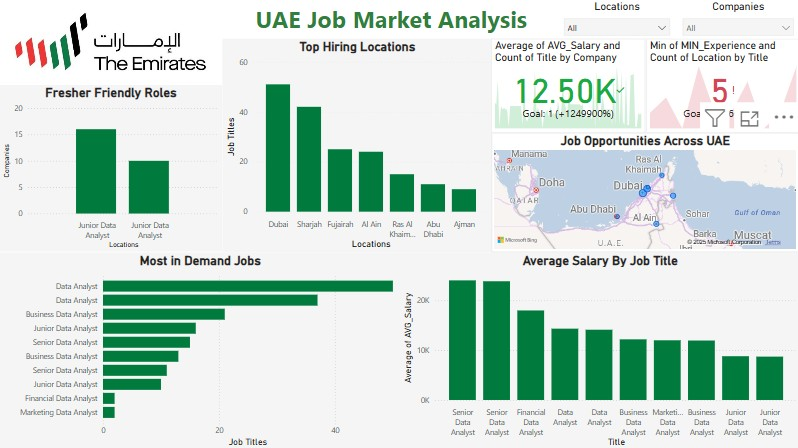

# 🇦🇪 UAE Job Market Analysis 📊

An interactive Power BI dashboard project analyzing job trends, hiring companies, top locations, in-demand skills, and fresher-friendly roles in the UAE.

---

## 🚀 Project Highlights

- 🔍 Data cleaned using **Python** (Pandas in Jupyter Notebook)
- 📊 Dashboard built in **Power BI**
- 🗺️ **Location mapping** with filters
- 👥 **Fresher roles**, in-demand **skills**, and **salary analysis**
- 📄 Summary report + visual walkthrough included

📸 *Scroll down for dashboard preview, full insights, and files.*

---

## 📌 Project Overview

This project explores job market dynamics in the UAE based on a real-world job listing dataset. It is designed to provide insights for job seekers, analysts, and recruiters by uncovering patterns in:

- Job openings by **location**
- **Top hiring companies**
- **Fresher-friendly opportunities**
- **Skill demand**
- **Experience vs. Salary** trends

The project includes a Power BI dashboard and a Python-based data cleaning notebook, making it a complete end-to-end data analytics case study.

---

## 🧩 Dataset Summary

| Column Name        | Description                                |
|--------------------|--------------------------------------------|
| `Title`            | Job title (e.g., Data Analyst)             |
| `Company`          | Hiring company name                        |
| `Location`         | UAE city or Emirate (e.g., Dubai)          |
| `MIN_Experience`   | Minimum experience required (in years)     |
| `MIN_Salary`       | Minimum monthly salary (AED)               |
| `MAX_Salary`       | Maximum monthly salary (AED)               |
| `Skills Required`  | Skills mentioned in the job description    |

> ✅ Data was cleaned to:
> - Remove nulls and duplicates  
> - Convert data types  
> - Standardize city names  
> - Create `Average Salary` column  
> - Identify fresher-friendly roles  

---

## 📊 Dashboard Features

### Visuals Used:
- 📍 **Map** of job distribution by location  
- 🏢 **Top hiring companies**  
- 📈 **Average salary by job title** (stacked column)  
- 🧑‍🎓 **Fresher-friendly job roles** (stacked column)  
- 💼 **Top in-demand skills** (clustered bar chart)  
- ✅ **KPI cards** showing total jobs, companies, locations  
- 🎛️ **Slicers** for filtering by company, location, and skills  

---

## 📸 Dashboard Preview

| Dashboard Sections |
|--------------------|
|  |

---

## 📘 Data Cleaning Notebook

The dataset was cleaned using Python in a Jupyter Notebook with `pandas`. The notebook includes:

- Handling nulls and invalid values  
- Filtering out irrelevant records  
- Creating derived fields like experience level  
- Saving the final cleaned dataset  

📄 View notebook: `data_cleaning_notebook.ipynb`

📸 Preview:

| Notebook |
|----------|
|  |

---

## 📄 Summary Report

For quick reference, a one-page PDF summary is included:

📁 `UAE_Job_Market_Summary_Report.pdf` 
Includes:
- Project objective  
- Visuals explanation  
- Key insights and recommendations  

---

## 📁 Repository Structure

| File / Folder                        | Description                               |
|-------------------------------------|-------------------------------------------|
| `dashboard_screenshots/`            | Screenshots of Power BI dashboard         |
| `jupyter_notebook/`                 | Python notebook and output image          |
| `UAE_Job_Market_Summary_Report.pdf` | Summary report                 |
| `UAE_Job_Market_Analysis.pbix`      | Power BI dashboard file                   |
| `uae_job_data_cleaned.csv`          | Cleaned dataset used for visuals          |
| `README.md`                         | This file                                 |

---

## 🔍 Key Insights

- 📍 **Dubai, Sharjah, and Fujairah** have the highest job demand  
- 🧑‍🎓 Numerous roles suitable for **freshers** (0–1 year exp)  
- 💰 **Average salary range**: AED 7,000 – 15,000  
- 💡 Most in-demand skills: **Advanced SQL, R, Power BI, Predictive Modeling**  
- 🏢 Over **90 unique companies** are actively hiring  

---

## 🙋‍♂️ About Me

**Ashad K**  
📍 India | 💼 Open to Data Analytics & BI roles in UAE  
📧 Email: [ashadakber32@gmail.com](mailto:ashadakber32@gmail.com)  
🔗 GitHub: [Ashad777](https://github.com/Ashad777)
🔗 [LinkedIn](https://www.linkedin.com/in/ashad-k)

---

## 🤝 Let’s Connect

If you're a recruiter, hiring manager, or fellow data professional, feel free to reach out. I'm actively seeking full-time roles in:

- 📊 **Data Analysis**  
- 📈 **Business Intelligence**  
- 🧠 **ML / AI Internships**  

Especially within the **UAE job market**.

---

⭐ If you found this project helpful, feel free to **star the repo** or connect with me!
